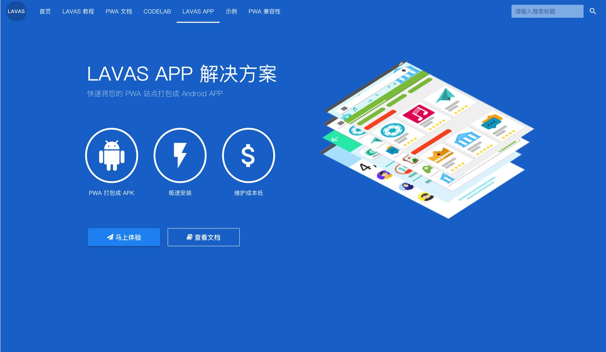

# LAVAS APP 简介

了解 [PWA](https://lavas.baidu.com/pwa) 的开发者都知道，PWA 能给用户带来渐进式的完美体验。但由于现在国内各大 Android 浏览器对 PWA 特性支持不一，并且系统厂商几乎都没有自动开放 PWA「添加到桌面」的权限，导致国内用户基本上不可能体验到 PWA 「添加到桌面」特性，对 Web 站点来说这就失去了一个很好的增加用户黏性的机会。

而 Lavas app 是一个面向站长、开发者等内容和服务提供方的一套将 PWA 站点打包成 Android app 的解决方案，这样开发者可以通过在 PWA 站点的预设的提示，引导用户通过下载安装 Lavas apk，可以间接达到「添加到桌面」的效果。

Lavas app 产出的 Lavas apk 支持 Service Worker，Cache API，Web Manifest 等PWA 特性，只需要开发一个 PWA 站点，就能让您的产品同时拥有 Web app 和 Native app 两种形态，可以大大减少开发人力的投入，并且能增加产品的用户粘性。

目前 Lavas App 解决方案整体包含三个部分：

- **Lavas App 打包平台**：用来打包的工具平台。
- **Lavas Apk**：可以被用户安装的 Android Apk 文件。
- **Lavas 内核**：支持 PWA 特性的核心

## Lavas app 打包平台

[https://lavas.baidu.com/app](https://lavas.baidu.com/app) 是百度提供的一个免费开放的 Lavas app 打包平台。在这个平台中，您可以管理 Lavas app，也可以管理 Lavas app 的 apk 每个版本，可以直接在线在平台上打包新的 Lavas apk，并且能够评估您的 PWA 站点质量。

Lavas app 打包平台支持多种功能来帮助您管理 PWA 应用:

- 支持应用管理
- 支持 apk 版本管理
- 支持在线打包
- 支持 PWA 站点在线审核

欢迎前往 **[https://lavas.baidu.com/app](https://lavas.baidu.com/app)** 进行体验。

## Lavas apk

Lavas apk 是打包平台中产出的 apk 安装文件，可以将 apk 文件提供给应用商店，也可以直接下载安装，Lavas app 解决方案提供统一的版本更新提示机制以及内核自动更新机制。

以下是 Lavas 官网的一个打包后的 apk，欢迎安装体验:

Lavas apk 有以下几个特点：

- app 离线可用
- 大小只有 300k 左右，用户可以极速安装，在体验上上甚至比 PWA「添加到桌面」更快
- 基于 Webview 实现，能最大程度的和 PWA 相结合
- app 原生接管页面外链跳转，切面切换更流畅
- 可通过应用市场分发
- 可自动版本控制，无需开发者自己管理版本序号

## Lavas 内核

Lavas 内核是 Lavas app 提供 PWA 特性支持的核心，在用户首次启动 app 的时候会检测最新的 Lavas 内核，如果当前系统不存在任何 Lavas 内核文件就会触发 Lavas 内核下载流程，将内核下载到用户设备本地，如果当前系统中存在 Lavas 内核文件则 app 直接使用已存在的最新Lavas 内核文件。

Lavas app 之所以轻量主要是把内核和 app 进行分离，对于用户来说，在一台设备上所有的 Lavas app 都只是共用一个 Lavas 内核，这样就可以为用户的设备大大减少存储空间的使用，解放用户的设备。

Lavas 内核目前支持了以下特性：

- 支持了 PWA 离线缓存相关特性
- 实现了 Web Manifest 标准

后续 Lavas 内核会支持 [Web Push API](/pwa/engage-retain-users/how-push-works) 和 [Web Notification API](/pwa/engage-retain-users/notification/notification-introduction) 以及消息推送机制，敬请期待～