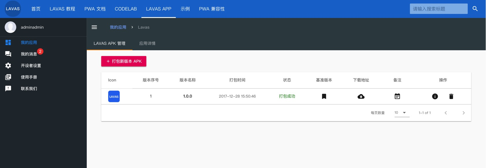
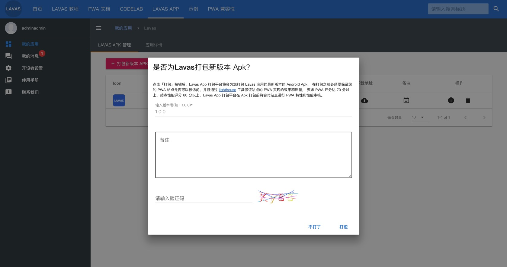
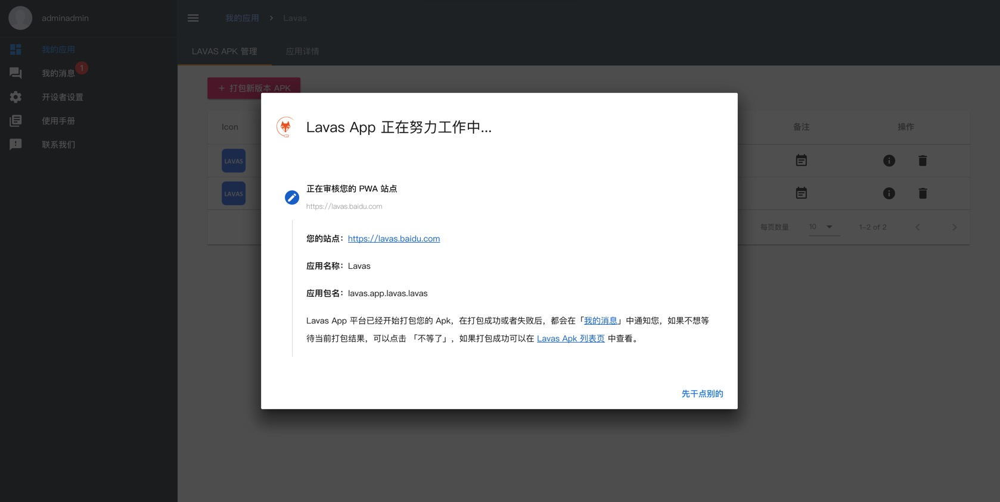

# 管理 Lavas apk 版本

Lavas app 打包平台支持 Lavas apk 版本管理，点击 PWA 应用的卡片，就会直接进入 Lavas apk 的管理页面，在这个页面中可以看到您的 PWA 项目所打出的所有版本的 apk 包，也可以在这个页面中发起 apk 打包流程。

每次打包成功之后，就会生成一个最新版本记录，您不必在乎 Lavas apk 的版本序号问题，因为 Lavas app 打包平台会自动管理版本编号，保证每次打出的包都是最新的，并且当用户安装时，能够直接替换掉已经安装的老的版本。

这个页面主要包含 apk 列表和 「**打包新版本 APK**」的按钮。

## apk 列表

列表的每一行是一个唯一的 apk 版本，您可以通过点击「**操作**」栏的 icon 查看 apk 详情或者删除 apk。也可以通过点击「**备注**」栏里的 icon 查看备注，了解当前版本的备忘信息。

下面这张图解释了 apk 列表中所有的 icon 的表示的操作：

### 设置线上基准版本

在这里想重点说一下「**设置线上基准版本**」这个操作，这个操作将会用来设置当前 apk 记录所对应的 apk 文件做为线上最新基准版本，当您点击这个按钮，并且在接下来的对话框中确认生效，则这个 apk 记录将永远不能被删除，并且 apk 所对应的 PWA 应用也不能被删除（一旦有 PWA 应用中有 apk 设置为线上基准版本都不能被删除）。

当设置为基准版本后，在用户打开 app 后，如果用户正在运行的 apk 版本序号小于您所设置的基准 apk 版本序号，则用户 app 会弹出对话框，提示引导用户下载您所设置的最新线上基准版本的 apk，如果走应用商店下载安装的用户，则会由应用商店接管更新，这就要求开发者每次发新版的时候都要慎重。

> info
>
> 现在 lavas app 的更新机制还在内测中，所以现在打包后的 apk 暂时不会触发自动更新，如果需要自动更新提示机制目前必须经过应用商店分发。

## 打包 apk

点击「**打包新版本 APK**」按钮，就会弹出打包信息表单，其中需要填写 **版本名称** 和 **备注信息**，版本名称为必填项。

1、**版本名称**：是表示 apk 的版本信息，原则是是每次新打包的版本号比列表中最大的版本号都要大，但是在 apk 打包操作中没有做这个限制，任何规范的版本号都可以，只是用来标识版本信息，而用户安装后的版本更新判断是通过 Lavas app 打包平台维护的 **版本序号** 来判断的。

2、**备注**：每次打包新版本都会有一些功能点的升级，可以做为备忘用。

打包 apk 还有几个注意事项：

- 打包之前如果还存在打包任务，不允许再次打包。
- 只能等打包任务结束后才可开始新的打包任务，或者取消之前的打包任务。
- 必须保证将要打包的 PWA 站点可访问并且稳定
- 必须通过 PWA 特性审核后才能开启打包生成 apk 的任务

当开启打包任务之后，会弹出进度弹窗 （当然可以点击「**先干点别的**」让它后台进行打包工作，打包完成之后，会在列表中更新当前打包进度）

无论打包成功或失败都会在 apk 列表第一条结果动态展现打包结果。当打包完成后，也可以通过 apk 列表中的「**操作**」栏里的 **信息** icon 查看最新结果，如果打包成功，则会展示下载地址和下载二维码（如果不点击之前的「**先干点别的**」并且打包成功的话，弹窗效果也会如下图所示）。

如果打包失败，则信息弹窗会告知相应的出错信息，如果是因为网络原因或者 Lavas app 打包平台的系统原因导致打包失败，请您稍候再试，如果是因为 PWA 审核失败导致打包失败，请 [查看审核结果页面](./view-pwa-validate) 查看原因。
