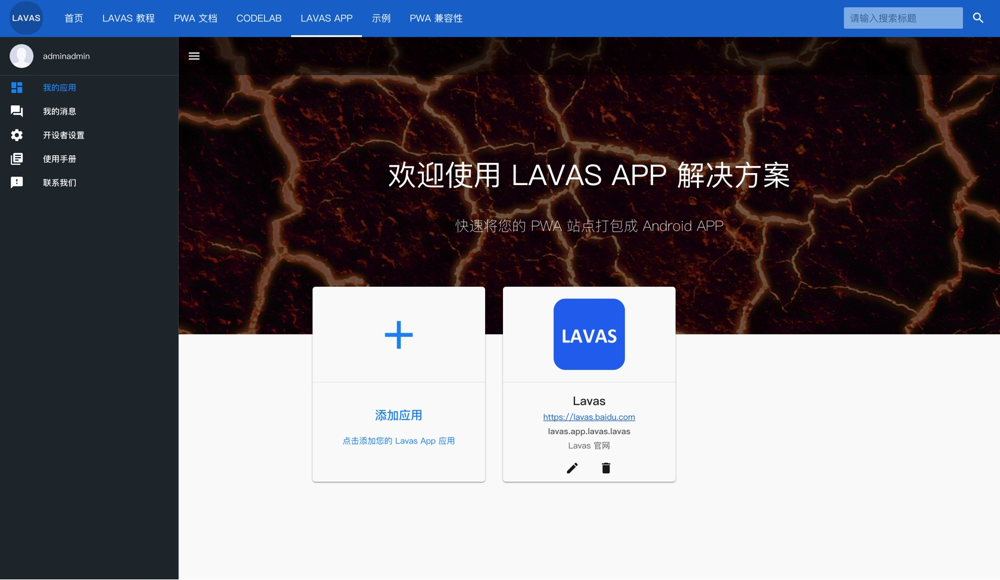
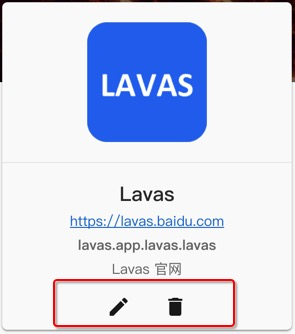

# 管理您的 PWA 应用

Lavas app 打包平台支持管理您的所有应用，这样就可以对您所有的 PWA 应用有一站式的体验，当完成登录后，直接可以进入应用管理页面。

## 添加 PWA 应用

进入应用管理页面后，可以点击最大的 `+` 号打开添加 PWA 应用弹窗进行添加您的 PWA 应用。添加应用的时候会需要让您填写一些应用信息，有以下几个必填的字段：

- PWA 站点 URL
- 应用名称
- 应用包名
- 应用 LOGO

为了让大家能够正确的添加应用，在下面将会说明一下这些信息将会被用来干什么。
### PWA 站点 URL

在 PWA 「添加到桌面」特性中，是根据 `manifest.json` 的 `start_url` 字段来标识用户点击添加到桌面上的 icon 之后将会打开哪个 URL，而在添加应用时候需要的 PWA 站点 URL 和 `start_url` 一样，也是为了指定 Lavas app 的 webview 将会打开哪个站点。所以原则上，我们建议 `PWA 站点 URL` 这个字段应该和 `start_url` 保持一致。

> info
>
> 为了后续好做流量来源区分统计，我们建议在 URL 后面加上 `fr=homescreen` 参数标识

### 应用名称

应用名称是用来指定用户安装 apk 之后展现的名称的，也就是 icon 下面的文字，相当于 `manifest.json` 中的 `short_name` 字段，有一个细节需要注意一下，这个字段在 app 启动画面的时候也 **可能** 也会展示出来。

为什么说是 "可能" 呢？因为参考 Web Manifest 标准，是使用 `manifest.json` 的 `name` 字段展示 PWA「添加到桌面后」的启动画面的文字的，Lavas app 在打包过程中会通过 `PWA 站点 URL` 字段去请求获取 PWA 站点的 `manifest.json` 文件，如果打包的时候文件获取成功，则用户在启动 app 的时候和 PWA 「添加到桌面」效果完全保持一致，如果在打包过程中文件获取失败，那 app 启动画面的文字会使用创建应用时的 `应用名称` 字段，原则上我们建议 `应用包名` 这个字段应该和 `short_name` 字段保持一致。

### 应用包名

应用包名字段指定的是用户安装的 apk 包名，比如 `lavas.com.baidu.lavas`，如果提交给应用商店，这也将是是提交给应用商店的 apk 包名，Lavas app 打包平台要求 **不允许平台中出现相同的应用包名**，也就是每个 PWA 应用都只会有一个唯一的应用包名。

### 应用 Logo

应用 Logo 相当于 `manifest.json` 中的 `icons` 字段，上传的 Logo 将用于安装后的桌面 icon，和 `应用名称` 类似，**可能** 被用来做为启动画面的图片，如果打包时 `manifest.json` 文件能够获取成功，启动画面则会和正常的 PWA 「添加到桌面」后保持一致，如果文件获取失败，则使用 `应用 Logo` 字段做为启动画面的图片。

> info
>
> 应用 Logo 图片的最大上传大小为 512 x 512

从 Lavas app 的应用添加来看，有个最基本的前提，就是您的站点必须是一个可访问的 https 站点，Lavas app 不支持 http URL 或者本地 localhost URL 用来添加应用。

## 操作 PWA 应用

PWA 应用管理开放了两个操作，`修改` 和 `删除`。

**修改 PWA 应用信息**
PWA 应用一旦新建成功以后，应用名称和应用包名是不允许被再次修改的，应用 Logo 的修改比较特殊，当您修改了应用 Logo 成功后，此后再打包成功的 apk 的安装到桌面的 icon 就是新的修改后的 Logo，但之前已经打包的 apk 还是使用之前老的 Logo。

**删除 PWA 应用信息**
PWA 应用管理还是开放了删除操作，主要考虑到删除 PWA 应用后，所有之前打的包就都会一起删除，所以需要谨慎操作 PWA 应用的删除，当然，如果开发者 [设置了线生效的基准版本 apk](./manage-your-lavas-apk#)，则不允许开发者删除 PWA 应用。
