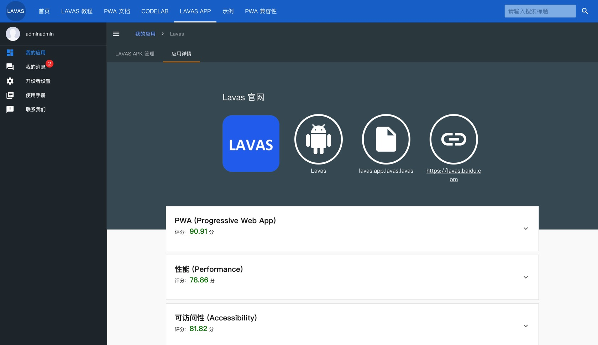
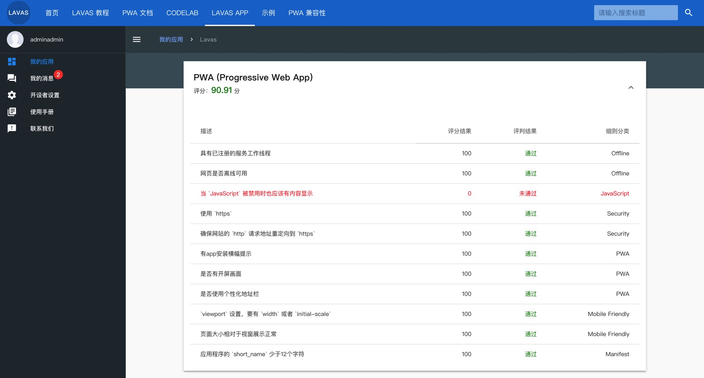

# 查看 PWA 审核结果

在 Lavas app 平台打包新版本 apk 之前，Lavas app 平台会先对您提交的 PWA 站点 URL 进行 PWA 特性审核，如果您的站点不符合 PWA 规范，则系统不会进行打包任务，最终会在 apk 列表中标为「**打包失败**」。

下面是审核页面的样式

这里所讲到的 PWA 检测是我们针对于提交的站点的一个评分策略（参考 GoogleChrome 团队的 [Lighthouse](https://developers.google.com/web/tools/lighthouse/) 方案），要求站点 PWA 分数必须在 70 分以上，并且性能评分在 60 分以上。以下是关于站点 PWA 的评分项：

- 是否注册了 Service Worker
- 站点是否离线可访问
- JS 被禁用了是否内容展现（是否有 AppShell）
- 是否是 https 站点
- http 是否自动重定向到 https
- 是否有 app 安装横幅提示 (站点是否包含有效的 manifest.json 文件)
- 是否有开屏画面（manifest.json 的 short_name 和 icons）
- 是否使用个性化地址栏（manifest.json 的 theme_color）
- `viewport` 设置，是否设置了 `width` 或者 `initial-scale`
- 页面大小是否相对于视窗展示正常
- 应用程序的 `short_name` 少于12个字符

为了保证打出的 apk 的体验，除 PWA 评分外，Lavas app 打包方案在审核中加入了性能的考量，需要让站点的性能评分 60 分以上。